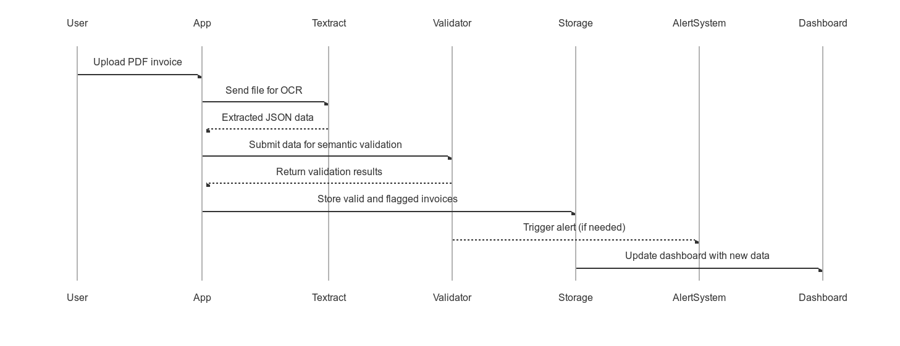

# Value Proposition and Market Validation

## Problem Statement

Invoice processing represents a critical administrative task for freelancers, small and medium-sized enterprises (SMEs), and accounting firms. However, improper handling of invoice data—whether due to human error, insufficient validation, or lack of automation—leads to significant economic, fiscal, and operational risks. Key pain points include:

| Common Error                  | Fiscal/Operational Consequence                            | Estimated Cost per Case |
|------------------------------|------------------------------------------------------------|--------------------------|
| Incorrect VAT calculation    | Incorrect tax reporting, risk of government penalties      | €60 – €300               |
| Duplicate invoices           | Double payments, account reconciliation issues             | €100 – €500              |
| Invalid or missing due dates | Misallocation of expenses or tax periods                   | €50 – €200               |
| Unregistered or lost invoices| Incomplete financial records; risk in audits               | Up to €600 per quarter   |
| Manual processing in Excel   | High error rate, no traceability or alerts                 | 20–30% increase in admin time |

Quantitative impact:

- Freelancers lose up to 5 hours per month due to manual invoice entry, equivalent to approximately €100 in lost productivity.
- SMEs processing 200 invoices per month may incur over €3,000 annually in error-related costs.
- Accounting firms report difficulties in managing multi-client flows with heterogeneous file formats, affecting team productivity and client satisfaction.

---

## Differentiation from Existing Solutions

FacturaScan 360 differentiates itself from conventional solutions such as Holded, Sage, basic OCR APIs, or manual workflows in Excel by integrating semantic validation, proactive alert systems, and simplified installation with minimal configuration.

| Solution             | OCR Automation | Semantic Validation | Proactive Alerts | Rapid Onboarding | Cost-Effective |
|----------------------|----------------|----------------------|------------------|------------------|----------------|
| Holded               | Partial         | No                   | No               | Yes              | No             |
| Sage                 | Yes             | No                   | No               | No               | No             |
| Excel + Macros       | No              | No                   | No               | Yes              | Yes            |
| Standard OCR Tools   | Yes             | No                   | No               | No               | No             |
| **FacturaScan 360**  | Yes (Textract)  | Yes                  | Yes              | Yes              | Yes (MVP-tier) |

Key distinguishing factors:

- Semantic validation of invoices, including VAT, due dates, and duplication.
- Proactive alert system integrated via email or communication tools (e.g., Slack, Teams).
- Structured data storage ready for accounting export and reporting.
- Fully operational MVP within minutes, without complex ERP integrations.

---

## MVP Functional Scope and Business Relevance

The MVP includes the following essential components aimed at immediate business value and operational utility:

| Functionality                   | Operational Impact                                       | Included in MVP |
|---------------------------------|----------------------------------------------------------|------------------|
| Invoice PDF Upload (Web/App)    | Enables streamlined intake of financial documents        | Yes              |
| OCR Processing (AWS Textract)   | Automates data extraction without manual intervention    | Yes              |
| Semantic Validation Engine      | Identifies inconsistencies (VAT, dates, duplicates)      | Yes              |
| Email Alert System              | Enables timely notifications for anomalies               | Yes              |
| Structured Storage (PostgreSQL) | Enables traceability and access to validated records     | Yes              |
| Basic Dashboard View            | Provides overview of invoices, suppliers, and errors     | Yes              |
| CSV/Excel Export Capability     | Facilitates external processing and audit-readiness      | Yes              |

The MVP offering addresses urgent operational needs for all segments and is built as a standalone product, without customizations per client.

---

## Branding and Naming Justification

**Product Name: FacturaScan 360**

The name encapsulates three core ideas:

- **Factura**: Directly refers to the core object of the system—financial invoices.
- **Scan**: Highlights the product’s core function—digitization and OCR.
- **360**: Denotes comprehensive visibility of the entire invoice lifecycle: upload, validation, alerting, and analysis.

Brand tone and visual identity:

- Professional, trustworthy, and technology-forward.
- Appropriate for both freelancers and enterprise-level use.
- Suggested brand palette: muted blue, dark gray, and soft green.
- Suggested tone: formal, concise, and informative.

---

## Buyer Persona Segmentation

| Segment           | Monthly Volume        | Core Need                                   | Purchase Decision Driver       | Acquisition Channels                     |
|------------------|------------------------|---------------------------------------------|--------------------------------|-------------------------------------------|
| Freelancers       | 10–50 invoices/month   | Reduce time on administrative tasks         | Individual decision             | SEO, LinkedIn Ads, productivity content   |
| SMEs              | 100–300 invoices/month | Reduce accounting errors and gain visibility| Operations Manager / CFO        | B2B sales, partner integrations           |
| Accounting Firms  | 1000+ invoices/month   | Scale document validation for clients       | Economic and operational value  | Direct sales, B2B alliances, integrations |

Pain points addressed:

- Tax penalties due to reporting errors or omissions.
- High administrative cost of manual validation.
- Lack of visibility and audit readiness across invoice flows.

---

## Semantic Validation Rules

The semantic validation engine applies a fixed, extensible set of rules to ensure invoice consistency:

| Rule ID | Validation Rule Description                         | Severity  | Detected Error Type        |
|--------|------------------------------------------------------|-----------|-----------------------------|
| V-01   | VAT must be ≥ 0 and not exceed 21% of subtotal       | Critical  | Fiscal error                |
| V-02   | Due date must not precede issue date                 | Major     | Temporal inconsistency      |
| V-03   | Duplicated invoice numbers from same supplier        | Critical  | Duplication                 |
| V-04   | Empty supplier field or unknown entity               | Major     | Missing metadata            |
| V-05   | Total ≠ subtotal + VAT (within tolerance)            | Critical  | Inconsistency in totals     |
| V-06   | Invalid file format (PDF corrupted or unsupported)   | Blocking  | Input ingestion error       |

All rules are applied automatically. No per-client customization is supported at the MVP stage.

---

## Usage Scenarios (Representative Use Cases)

### Use Case 1 – Freelancer  
An independent contractor uploads receipts from various service providers. One of the PDFs is accidentally uploaded twice. The system flags the duplicate and sends an alert via email before export.

### Use Case 2 – SME  
An internal administrator uploads invoices weekly. A discrepancy is found between subtotal and VAT in one document. The platform highlights the document in red on the dashboard and blocks further processing until reviewed.

### Use Case 3 – Accounting Firm  
A firm manages invoice intake for ten clients. The system provides a filtered view per client, and any validation errors are summarized weekly in a downloadable report used to correct upstream workflows.

---

## Expected Performance Metrics (MVP KPIs)

| KPI                                | Target Value (MVP)     | Description                                     |
|-----------------------------------|-------------------------|-------------------------------------------------|
| Average processing time/invoice   | < 5 seconds             | From upload to validation                       |
| Anomaly detection rate            | > 90% (on synthetic set)| Rate of semantic rule triggers                  |
| Email alert latency               | < 60 seconds            | From detection to dispatch                      |
| Monthly cost per 100 invoices     | < €3 (Textract + infra) | Infrastructure sustainability                   |
| Time saved per user/month         | 3–10 hours              | Based on manual comparison baseline             |

---

## End-to-End Workflow Diagram (Mermaid)

---

## Segment Value Summary Table

| Segment         | Time Saved (monthly) | Errors Prevented | Estimated Value (€) |
| --------------- | -------------------- | ---------------- | ------------------- |
| Freelancer      | 3–5 hours            | 1–2              | 100–150             |
| SME             | 10–15 hours          | 4–6              | 300–500             |
| Accounting Firm | 20–30 hours          | 10+              | 800–1,000           |

---

## Total Cost of Ownership Comparison

| Item                      | Manual Process      | FacturaScan 360 (MVP)     |
| ------------------------- | ------------------- | ------------------------- |
| Monthly staff time        | 10–20 hours         | &lt 1 hour                |
| Error correction workload | High                | Minimal                   |
| Visibility / traceability | Low (email, Excel)  | High (dashboard, alerts)  |
| Audit readiness           | Poor                | Structured and exportable |
| Monthly operational cost  | Implicit (€200–400) | Explicit (&lt; €10–15)    |

---