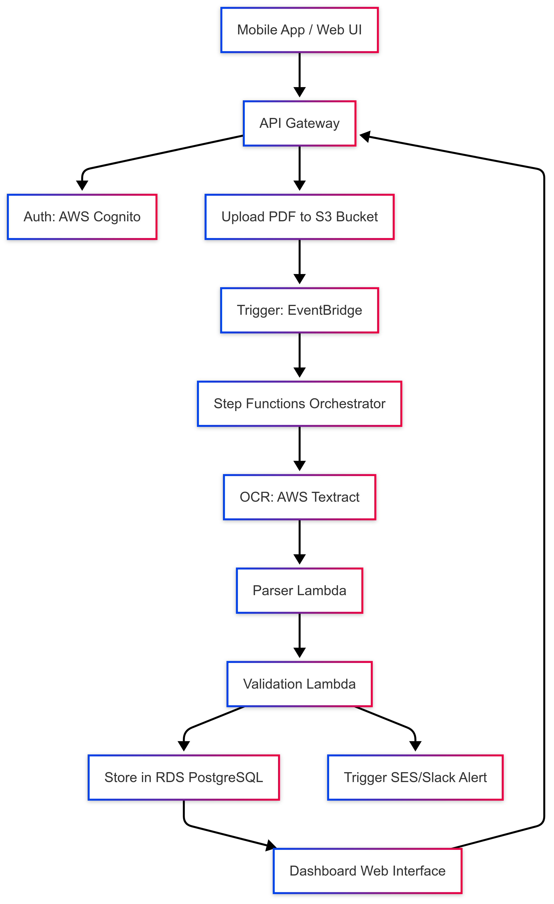

# AWS Cloud Architecture for Multi-Tenant SaaS – FacturaScan 360

## Overview

This document outlines the technical architecture of FacturaScan 360 as a scalable, secure, and modular SaaS platform hosted on Amazon Web Services (AWS). The system supports multi-tenant operation, automatic OCR of PDF invoices, semantic validation, structured storage, and alerting. It is designed for long-term extensibility, regulatory compliance, and efficient operation under variable load.

---

## 1. Core Architectural Objectives

The architecture is defined to satisfy the following primary requirements:

- **Secure multi-tenant isolation** (logical or physical separation).
- **Event-driven, decoupled orchestration** of invoice processing pipeline.
- **Native integration with AWS OCR (Textract)**.
- **Low-latency, scalable document storage and structured data persistence**.
- **User authentication and authorization via AWS Cognito**.
- **Email and messaging-based alerts** for invoice anomalies.
- **Optional EC2-based deployment for clients with on-prem constraints**.
- **Extensibility** for future modules including dashboards, AI, MCP and ERP integration.

---

## 2. High-Level Component Diagram (Logical View)

---

## 3. Component Breakdown

### 3.1. User Interaction Layer

| Component                | Description                                                     |
| ------------------------ | --------------------------------------------------------------- |
| **Web Dashboard**        | Backoffice for browsing invoices, validation status, errors.    |
| **Mobile App (Flutter)** | Enables photo capture and upload of invoice PDFs.               |
| **API Gateway**          | Serves as the main entry point for both mobile and web clients. |

---

### 3.2. Authentication and Access Control

| Component       | Functionality                               | Notes                                |
| --------------- | ------------------------------------------- | ------------------------------------ |
| **AWS Cognito** | Manages user pools, registration, login     | Token-based (JWT) authentication     |
| Role mapping    | Support for roles: viewer, validator, admin | Future RLS integration in PostgreSQL |

---

### 3.3. Storage and Persistence

| Type             | AWS Service       | Purpose                                      |
| ---------------- | ----------------- | -------------------------------------------- |
| **Unstructured** | S3                | Stores uploaded invoice PDFs                 |
| **Structured**   | RDS PostgreSQL    | Stores parsed invoice data, metadata, errors |
| Alternative      | DynamoDB (future) | For metadata if latency/scale requires       |

---

### 3.4. Invoice Processing Pipeline

| Phase             | Implementation                 | Description                                      |
| ----------------- | ------------------------------ | ------------------------------------------------ |
| **Trigger**       | Amazon S3 → EventBridge        | Upload triggers event upon file creation         |
| **Orchestration** | AWS Step Functions             | Manages the entire pipeline sequentially         |
| **OCR**           | AWS Textract (Sync API)        | Extracts raw fields from invoice PDF             |
| **Parsing**       | AWS Lambda (Python)            | Normalizes fields, converts to structured format |
| **Validation**    | AWS Lambda (Python)            | Applies rule-based semantic checks               |
| **Storage**       | Lambda → RDS (PostgreSQL)      | Inserts final validated records into DB          |
| **Alerting**      | Amazon SES / Webhooks to Slack | Notifies user or admin about errors or issues    |

---

### 3.5. Dashboard and UI Layer

* Developed with Flask + Jinja2 + Tailwind CSS.
* Fetches data via internal API from PostgreSQL.
* Provides:

  * Invoice list, grouped by supplier/date/status.
  * Visual validation status.
  * Error inspection interface.

---

## 4. Multi-Tenant Strategy

| Mode                      | Description                                           |
| ------------------------- | ----------------------------------------------------- |
| **Logical isolation**     | Use `tenant_id` in all DB records (RLS in PostgreSQL) |
| **Authentication domain** | Users assigned to specific tenants via Cognito groups |
| **Storage**               | Optional prefix-based isolation in S3 buckets         |
| **Dashboards**            | Filtered views by `tenant_id` in query layer          |

This model supports growth from single-tenant deployments to isolated multi-tenant architecture without major redesign.

---

## 5. Alert and Notification Subsystem

| Type               | Technology       | Description                                   |
| ------------------ | ---------------- | --------------------------------------------- |
| **Email Alerts**   | Amazon SES       | Sent to users on validation failure           |
| **Message Alerts** | Slack / MS Teams | Optional webhook connectors for real-time ops |
| **Logging**        | CloudWatch       | Stores validation traces, errors, performance |

---

## 6. Optional EC2-Based Deployments

Certain clients may require private environments due to compliance. The architecture allows deployment on dedicated EC2 nodes with:

* Reverse proxy (Nginx) in front of API and dashboard.
* S3-compatible object storage (e.g., MinIO).
* PostgreSQL on a secured instance with backup policies.
* VPN or static IP access control.

These are offered under a separate service-level agreement (SLA).

---

## 7. Extensibility and Future Modules

The architecture supports future integration of the following modules without refactoring core services:

| Module                         | Integration Notes                                       |
| ------------------------------ | ------------------------------------------------------- |
| **Explainable AI (MCP)**       | Connected to parser output and validation logs          |
| **Advanced dashboards**        | Optional BI layer (e.g., Superset, Metabase, Streamlit) |
| **ERP integration**            | Webhooks + REST APIs with Odoo, Holded, etc.            |
| **Billing system**             | Stripe, Chargebee via API gateway routing               |
| **User roles and permissions** | Managed through Cognito groups + RLS PostgreSQL         |

---

## 8. Infrastructure as Code and Monitoring

To ensure reproducibility, scaling, and auditing, the infrastructure is provisioned and managed with:

| Aspect              | Tooling                           |
| ------------------- | --------------------------------- |
| **Provisioning**    | Terraform / AWS CDK               |
| **CI/CD Pipelines** | GitHub Actions / CodePipeline     |
| **Monitoring**      | CloudWatch Metrics + Alarms       |
| **Logging**         | CloudWatch Logs + Lambda insights |

---

## 9. Security and Compliance

| Domain         | Mechanism                                  |
| -------------- | ------------------------------------------ |
| **In-transit** | HTTPS via ACM / Cognito Auth               |
| **At-rest**    | S3 encryption (SSE), RDS encryption (KMS)  |
| **IAM**        | Least-privilege roles per Lambda / service |
| **Backups**    | RDS snapshots + S3 versioning              |
| **Auditing**   | CloudTrail for all control plane activity  |

---

## 10. Estimated Monthly Cost (MVP Range)

| Service                      | Assumed Volume (per tenant) | Estimated Monthly Cost |
| ---------------------------- | --------------------------- | ---------------------- |
| S3 Storage                   | 1–2 GB                      | \~€0.05                |
| AWS Textract                 | 100–200 pages               | \~€2.00                |
| Lambda (parser + validation) | 10,000 calls @ 128MB        | \~€0.50                |
| RDS PostgreSQL (shared)      | t3.micro, 20GB              | \~€12.00 (shared)      |
| SES Email                    | 500 emails                  | \~€0.05                |
| EC2 Hosting                  | t3.micro or t3a.micro       | \~€8.00                |

Total estimated base cost per client: **€3–5/month** + shared infrastructure.

---
