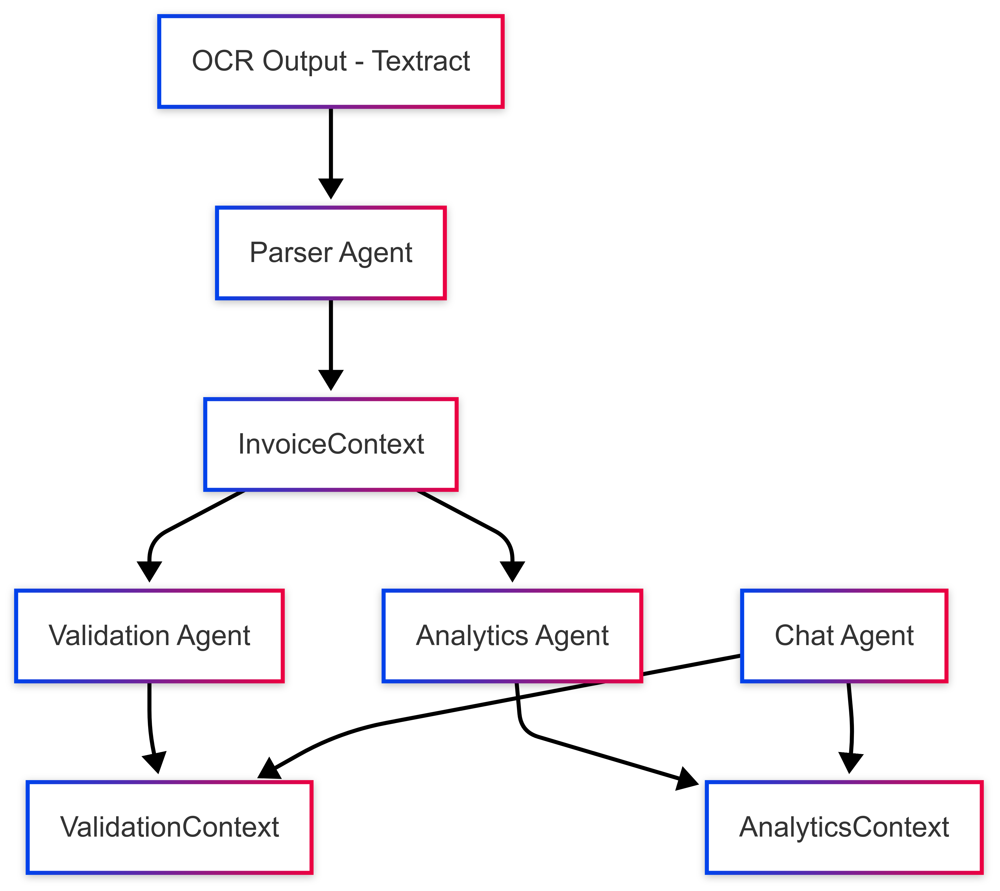

# Model Context Protocol (MCP) – Design Specification

## Overview

The **Model Context Protocol (MCP)** defines a set of semantic schemas for structured communication between AI agents within *FacturaScan 360*. Each MCP context represents a self-contained view of the system state, derived from one or more processing stages (OCR, parsing, validation, analytics) and used as inputs or outputs in agent interactions.

MCP ensures:

- Machine-readable, modular data exchange
- Traceability of agent reasoning
- Compatibility with JSON-based pipelines and conversational agents
- Decoupling between raw data sources and cognitive interfaces (e.g., chatbots)

---

## 1. MCP Design Philosophy

| Feature                 | Description                                                                 |
|-------------------------|-----------------------------------------------------------------------------|
| **Contextualized**      | Each context includes only the necessary, enriched information              |
| **Declarative**         | Values are not procedural outputs but declarative facts for consumption     |
| **Composable**          | Contexts can be passed between agents or stored in database as-is           |
| **Extensible**          | Schemas support versioning and addition of new fields or agent scopes       |

---

## 2. Agent Interaction Graph (Conceptual)



---

## 3. `InvoiceContext` Schema

Represents the semantic, normalized representation of a scanned invoice.

### JSON Schema (v1.0)

```json
{
  "invoice_id": "UUID",
  "tenant_id": "UUID",
  "supplier_name": "string",
  "supplier_tax_id": "string",
  "invoice_number": "string",
  "issue_date": "YYYY-MM-DD",
  "due_date": "YYYY-MM-DD",
  "currency": "string",
  "subtotal": "number",
  "vat": "number",
  "total": "number",
  "line_items": [
    {
      "description": "string",
      "unit_price": "number",
      "quantity": "number",
      "tax_rate": "number",
      "category": "string"
    }
  ],
  "payment_method": "string",
  "ocr_confidence": "float (0-1)",
  "source_pdf": "s3://.../file.pdf",
  "version": "1.0"
}
```

### Usage

* Input to `ValidationAgent` and `AnalyticsAgent`
* Stored in `invoice_context` field in the `invoices` table
* Immutable once validated

---

## 4. `ValidationContext` Schema

Captures validation rules applied, their results, and agent decisions.

### JSON Schema (v1.0)

```json
{
  "invoice_id": "UUID",
  "agent": "ValidationAgent_v1.0",
  "validation_date": "timestamp",
  "rule_results": [
    {
      "rule_id": "V-01",
      "description": "VAT must be between 0 and 21%",
      "passed": false,
      "severity": "critical",
      "value_observed": 0.25,
      "suggestion": "Verify supplier or tax zone",
      "references": ["invoice_context.vat"]
    }
  ],
  "overall_status": "invalid",
  "notes": "Detected VAT anomaly",
  "version": "1.0"
}
```

### Usage

* Consumed by alerting modules and chat/report agents
* Stored in `validation_context` in the `invoices` table
* Cross-referenced with rules library (versioned)

---

## 5. `AnalyticsContext` Schema

Provides structured metrics and insights derived from the invoice, often for use in business intelligence or conversational querying.

### JSON Schema (v1.0)

```json
{
  "invoice_id": "UUID",
  "agent": "AnalyticsAgent_v1.0",
  "processed_at": "timestamp",
  "insights": {
    "supplier_category": "telecommunications",
    "total_in_year": 13850.25,
    "monthly_spend_avg": 1154.19,
    "anomaly_flag": false,
    "price_variation": {
      "compared_to_last_invoice": "+12.4%",
      "12_month_trend": "increasing"
    },
    "cost_center": "Operations"
  },
  "version": "1.0"
}
```

### Usage

* Input to Chat Agent for queries like:

  * "Which supplier increased their prices the most?"
  * "How much did we spend this quarter on office supplies?"
* Also used in dashboards and reporting systems

---

## 6. Schema Versioning

All contexts include a `version` field. Schema evolution is handled as follows:

| Change Type        | Action             | Backward Compatibility |
| ------------------ | ------------------ | ---------------------- |
| Add optional field | Minor version bump | ✅ Yes                  |
| Add required field | Major version bump | ❌ No                   |
| Change field type  | Major version bump | ❌ No                   |
| Deprecate field    | Minor version bump | ✅ Yes (with fallback)  |

Version parsing and validation is handled by the AI agent orchestration layer.

---

## 7. Persistence in Database

| Context Field     | Table      | Column                       |
| ----------------- | ---------- | ---------------------------- |
| InvoiceContext    | `invoices` | `invoice_context` (JSONB)    |
| ValidationContext | `invoices` | `validation_context` (JSONB) |
| AnalyticsContext  | `invoices` | `analytics_context` (JSONB)  |

These fields are indexed using PostgreSQL GIN indexes where required.

---

## 8. Security and Traceability

* All contexts are immutable after agent generation.
* Any regeneration (e.g., revalidation) results in a new row or versioned history (optional).
* Contexts are signed (or hashed) for audit traceability if legal assurance is needed.

---

## 9. Summary

The MCP structure supports scalable AI orchestration by:

* Encapsulating each phase of invoice understanding.
* Structuring internal data exchange between intelligent agents.
* Providing a unified schema for audit, analysis and conversational interfaces.

Next: see [`07-conversational-agent.md`](./07-conversational-agent.md) for how queries like "Which supplier increased prices the most?" are processed using `AnalyticsContext`.

