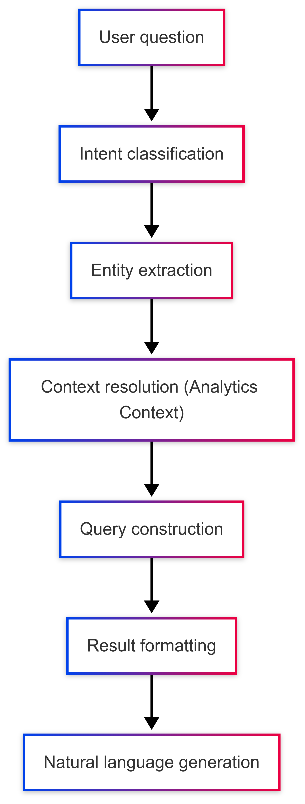

# Conversational Analytics Agent – MCP Integration

## Overview

The **Conversational Analytics Agent** in *FacturaScan 360* is designed to provide users with intelligent, context-aware answers to business queries over invoice data. It leverages the `AnalyticsContext` generated for each invoice, pre-aggregated insights, and semantic parsing to translate natural language questions into structured data operations.

This document defines the input-output behavior, internal logic, and architectural integration of the conversational layer with the MCP ecosystem.

---

## 1. Objective

To enable business users (accountants, CFOs, administrators) to ask questions in natural language such as:

- "Which supplier increased prices the most this quarter?"
- "Where do we spend the most money?"
- "What is our monthly average in telecommunications?"
- "Show me anomalies in invoices from the past 60 days."

---

## 2. Inputs and Dependencies

| Input Type        | Source                           | Format                             |
|-------------------|----------------------------------|------------------------------------|
| User question     | Web dashboard chat UI / API      | Free-text natural language         |
| Invoice data      | `AnalyticsContext[]`             | JSONB entries from PostgreSQL      |
| Validation flags  | `ValidationContext[]` (optional) | For anomaly queries                |
| Metadata          | `tenant_id`, `date range`, `user role` | Contextual filter for queries     |

---

## 3. Agent Pipeline



---

## 4. Supported Question Types (v1)

| Category           | Sample Questions                               | Source Field                         |
| ------------------ | ---------------------------------------------- | ------------------------------------ |
| Supplier trends    | "Who raised prices the most?"                  | `price_variation`                    |
| Expense overview   | "Where do we spend the most?"                  | `monthly_spend_avg`, `total_in_year` |
| Categorized totals | "How much did we spend on software last year?" | `supplier_category`, `total_in_year` |
| Anomaly detection  | "Show me invoices flagged as anomalies"        | `anomaly_flag`                       |
| Time-based metrics | "Monthly spend in telecom over past 6 months"  | `monthly_spend_avg`, timestamps      |

---

## 5. Internal Logic

### 5.1. Intent Classification

Model trained to classify input into:

* Aggregation queries (sum, average)
* Ranking (max/min)
* Filtering (category, supplier, period)
* Anomaly detection
* Temporal trends

### 5.2. Entity Extraction

Entities identified:

* Suppliers (by name)
* Categories (e.g., “software”, “transport”)
* Time ranges (“this year”, “last 6 months”)
* Metrics (“spend”, “variation”)

### 5.3. Context Resolution

Queries are filtered by:

* `tenant_id`
* Predefined time range
* `AnalyticsContext` version compatibility

---

## 6. Sample Query Flow

### User Input

> "Which supplier increased their prices the most this year?"

### Resolution

```json
{
  "intent": "ranking",
  "entity": "supplier",
  "metric": "price_variation.12_month_trend",
  "filter": { "date_range": "last_12_months" }
}
```

### SQL Behind

```sql
SELECT
  analytics_context->>'supplier_category' AS category,
  invoice_context->>'supplier_name' AS supplier,
  (analytics_context->'price_variation'->>'12_month_trend') AS trend,
  MAX(analytics_context->'price_variation'->>'compared_to_last_invoice') AS max_increase
FROM invoices
WHERE tenant_id = :tenant_id
  AND created_at &gt; current_date - interval '12 months'
GROUP BY supplier, category, trend
ORDER BY max_increase DESC
LIMIT 1;
```

### Agent Output (natural language)

> “Supplier *ACME Cloud Hosting* shows the highest price increase over the past 12 months, with an average variation of **+18.7%**.”

---

## 7. Error Handling and Fallbacks

| Scenario                       | Agent Behavior                       |
| ------------------------------ | ------------------------------------ |
| Ambiguous question             | Prompt for clarification             |
| No data in range               | “No invoices found for this period.” |
| Missing `AnalyticsContext`     | Notify user of data still processing |
| Invalid supplier/category name | Suggest close matches                |

---

## 8. Integration Pattern

* REST API endpoint: `POST /chat/query`
* Input: `{ "question": "...", "tenant_id": "..." }`
* Output: `{ "answer": "...", "sql": "...", "context": {...} }`
* Optionally log conversation in `chat_logs` table for training

---

## 9. Future Roadmap

| Feature                      | Version Target |
| ---------------------------- | -------------- |
| Multilingual support (ES/EN) | v1.1           |
| Drill-down interactive UI    | v1.2           |
| Custom metrics via UI        | v1.3           |
| Integration with BI agents   | v2.0           |

---

## 10. Summary

The conversational analytics agent operationalizes `AnalyticsContext` into business-relevant, explainable insights. It enables clients to:

* Interrogate their invoice data directly via natural language.
* Receive structured, traceable responses.
* Derive immediate value from MCP-driven AI orchestration.
